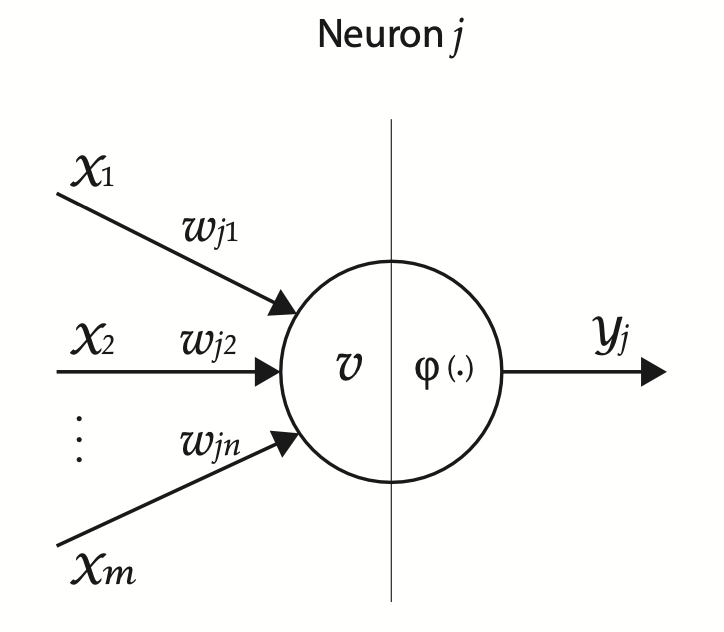

# multilayer-perceptron
This repository contains the implementation of a Multilayer Perceptron from
scratch in Python.

Basic Neuron Model:

Author: [@rmateusc](https://github.com/rmateusc)

# References
[Multilayer Perceptron Explained with a Real-Life Example and Python Code: Sentiment Analysis](https://towardsdatascience.com/multilayer-perceptron-explained-with-a-real-life-example-and-python-code-sentiment-analysis-cb408ee93141)

[Crash Course on Multi-Layer Perceptron Neural Networks](https://machinelearningmastery.com/neural-networks-crash-course/)